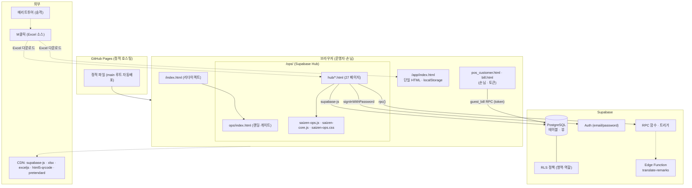

# 02. 시스템 아키텍처 (SYSTEM ARCHITECTURE)

> **저장소명**: `saizenjp/saizenjp.github.io`
> **브랜치**: `main`
> **기준 커밋**: `8cd0ad8` (`8cd0ad8f8f68db0a2c9679e2c6452c769846b000`)
> **작성일**: 2026-07-21
> **문서 상태**: 기술기준 (코드 근거)
> **분석 범위**: 전체 구성·인증·업로드·외부 연결
> **제외 범위**: 실제 키/비밀값

---

## 1. 전체 시스템 구성

- **정적 프론트엔드(GitHub Pages) + BaaS(Supabase)** 아키텍처. **자체 애플리케이션 서버 없음.** 브라우저가 Supabase에 직접 접속.
- 두 개의 독립 축:
  - **`/app/index.html`** — 단일 HTML(약 10,869줄), **localStorage** 기반 인쇄·출력. Supabase 미사용. 외부 라이브러리 CDN.
  - **`/ops/`** — **Supabase** 기반 다중 페이지 Hub(로그인·RLS·다중 화면). 공유 `ops/assets/saizen-ops.js`·`saizen-core.js`·`saizen-ops.css`.
- 진입: 루트 `index.html` → `/ops/` 리다이렉트(게이트 없음). 근거 `index.html`.

## 2. 프론트엔드 / 백엔드 / 데이터베이스 구분

| 계층 | 구현 | 근거 |
|---|---|---|
| **프론트엔드** | 정적 HTML/CSS/JS(빌드 없음). ops 페이지 27종 + 공유 asset. | `ops/hub/*.html`, `ops/assets/*` |
| **백엔드(로직)** | Supabase의 **RPC 함수 · 트리거 · RLS**(SQL) + Edge Function 1건. 자체 서버 없음. | `ops/hub/sql/*.sql`, `ops/edge-functions/translate-remarks/index.ts` |
| **데이터베이스** | Supabase PostgreSQL. 클라이언트가 `supabase-js@2`로 직접 쿼리. | `ops/hub/sql/`, `ops/assets/saizen-ops.js` |
| **인증** | Supabase Auth(email+password, 초대 발급). | `ops/assets/saizen-ops.js`, `sql/18` |

## 3. Mermaid — 시스템 구성도

## 4. 서버 · 외부 서비스 연결

- **Supabase 접속**: `authClient()`가 `supabase.createClient(SB_URL_DEFAULT, SB_KEY_DEFAULT)` — URL·**publishable key**는 `ops/assets/saizen-ops.js:16-19`에 내장(+localStorage `saizen_sb_url`/`saizen_sb_key`로 덮어쓰기 가능).
- **CDN**: `supabase-js@2`, `xlsx@0.18.5`(SheetJS), `exceljs 4.3.0`, `html5-qrcode@2.3.8`, `pretendard@1.3.9`. 근거 grep(app/·ops/).
- **Edge Function**: `ops/edge-functions/translate-remarks/index.ts` — 비고 번역(remark_ja/remark_local_ja 캐시, `sql/64`)로 추정. 배포·호출 여부 **확인 필요**.

## 5. 인증 구조

- **로그인**: `supabase.auth.signInWithPassword({email,password})`(`saizen-ops.js:1240-1246,1290-1294`). 세션은 `auth.getSession()`(`mountAuth`, `:1186-1208`).
- **계정 발급**: 마스터(admin)가 Supabase Invite로 발급(자가 회원가입 없음). 초대/비번재설정 링크 처리 `handleAuthRedirect()`(`:1527-1561`).
- **권한**: `me_access` RPC(`sql/18`) → `{role(admin/manager/staff), areas[], read_areas[], active}`. 페이지가드 `guardPage()`(`:1472-1493`)가 `<body data-so-area>`로 UI 차단. **실제 방어는 RLS**(`13_SECURITY_AND_RISKS`).

## 6. 파일 업로드 및 저장 구조

- 업로드 = **클라이언트 측 Excel 파싱만**(SheetJS). 파일을 서버/스토리지에 올리지 않음 → 브라우저에서 파싱 후 Supabase 행 upsert. 근거 `step1.html`, `groupcodes.html`. 상세 `06_EXCEL_IMPORT_FLOW.md`.
- 생성물(네임택·수배서·정산표 등) = 브라우저 인쇄/ExcelJS 다운로드(서버 저장 없음).

## 7. 관련 파일 경로 요약

- 진입/리다이렉트: `index.html`, `ops/index.html`
- 공유 런타임: `ops/assets/saizen-ops.js`(인증·게이트·chrome·키내장), `ops/assets/saizen-core.js`(도메인), `ops/assets/saizen-ops.css`
- 백엔드: `ops/hub/sql/*.sql`, `ops/edge-functions/translate-remarks/index.ts`
- 배포/CI: `.github/workflows/ci.yml`, `package.json`, `scripts/check-syntax.mjs`
