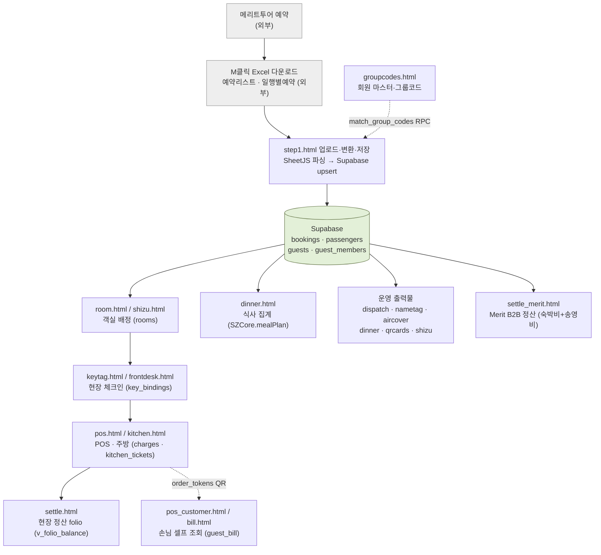

# 03. 업무 흐름 (BUSINESS FLOW)

> **저장소명**: `saizenjp/saizenjp.github.io`
> **브랜치**: `main`
> **기준 커밋**: `8cd0ad8` (`8cd0ad8f8f68db0a2c9679e2c6452c769846b000`)
> **작성일**: 2026-07-21
> **문서 상태**: 기술기준 (코드에서 확인된 사실 기반)
> **분석 범위**: 예약 유입 → 정산 전체 흐름, `/ops/hub/*.html`
> **제외 범위**: 실제 데이터, 외부 M클릭 내부 동작

---

## 1. 전체 흐름 (의도 vs 구현)

| 단계 | 구현 페이지 | 상태 |
|---|---|---|
| 메리트투어 예약 → M클릭 Excel 다운로드 | (외부 M클릭) | 시스템 외부 |
| 야마나미 시스템 Excel 업로드 → 저장/변환 | `step1.html` (+ `groupcodes.html`) | **구현됨** |
| 예약목록 | 전용 페이지 없음 · `frontdesk.html` 리스트로 대체 | **부분 / 확인 필요** |
| 객실 배정 | `room.html` (+ `shizu.html`) | **구현됨** |
| 식사 관리 | `dinner.html` (`SZCore.mealPlan`) | **구현됨** |
| 송영 관리(배차) | **없음** (정산 요금 라인만 존재) | **미구현 / 백로그** |
| 운영용 출력물 | `dispatch`·`nametag`·`aircover`·`dinner`·`qrcards`·`notice`·`shizu` | **구현됨** |
| 현장 체크인 | `keytag.html`(key_bindings)·`frontdesk.html` | **구현됨** (단 `check_status` 상태전이 미구현) |
| POS 연동 | `pos`·`kitchen`·`menu`·`pos_customer`·`bill` | **구현됨** (외부 POS 미연동, 내부 charges 직적재) |
| 정산 | `settle.html`(folio) + `settle_merit.html`(B2B) | **구현됨** |

## 2. Mermaid 업무 흐름도

> ⚠ **송영 관리(배차)** 노드는 흐름에 없음 — `/ops/`에 배차 기능 미구현(백로그). 송영 "요금"만 `settle_merit.html`에 반영.

## 3. 단계별 상세

### 3-1. Excel 업로드·저장/변환 — `step1.html` (data-so-area=`step1`)
- **입력자료**: 엠클릭 `예약리스트`(→`res` 슬롯) · `일행별예약`(→`ilhaeng` 슬롯). ※`회원그룹코드`는 `groupcodes.html`이 별도 처리.
- **처리 로직**: SheetJS로 첫 시트 파싱 → 필터(`구분`∈견적/대기/확정/정산, `detectAccom`가 야마나미/쿠주/간지/시즈만) → `bookings`·`passengers` upsert → `match_group_codes` RPC로 그룹코드 계산 → `guests`·`guest_members` 생성(회원=코드, 비회원=F풀 자동배정) → 유령행/월단위 취소 정리.
- **저장 데이터**: `bookings`·`passengers`·`guests`·`guest_members` + `change_log`(취소이력) + `import_log`. 상세 `06_EXCEL_IMPORT_FLOW.md`.
- **다음 단계 전달**: `guests.group_code`/`guest_members.person_tag`(태그코드), 항공/숙소 정보 → 배정·식사·인쇄가 재계산 없이 읽어 사용.
- **자동/수작업**: 자동(파싱·매핑·그룹코드·취소정리). 수작업 가능성 = F풀 미보유/불일치 코드 보정(`groupcodes.html`).

### 3-2. 객실 배정 — `room.html` (data-so-area=`room`)
- **입력**: `guests`+`bookings`·`guest_members`·`room_inventory`·`rooms`·`room_closures`.
- **처리**: 자동배정(회원→디럭스, 2-pass 예약순, 층 규칙, 정원 가드) + 수기/분할/폐쇄. `assign_source` auto/manual.
- **저장**: `rooms`(1행=1명) + `change_log`. 조기퇴실 시 `guest_members.actual_dep`.
- **출력/다음**: 방번호 → 프론트데스크·시즈예약표·정산 folio. 상세 `07_ROOM_ASSIGNMENT_FLOW.md`.
- **자동/수작업**: 자동배정 후 현장 수기 조정. 시즈노야도는 `shizu.html` 전담.

### 3-3. 식사 관리 — `dinner.html` (data-so-area=`print`)
- **입력**: `bookings`·`guests`·`passengers`·`guest_members` + `print_overrides`·`dinner_addons`.
- **처리**: `SZCore.mealPlan`으로 朝/昼/夕 식수 자동집계(숙소그룹·요일·PUS/ICN·조기퇴실 반영) + 석식제외·別注·팀묶기.
- **출력**: 夕食オーダー(A3 인쇄) + Excel + レストラン名札. 상세 `08_MEAL_SHUTTLE_OPERATION.md`.
- **자동/수작업**: 규칙 자동집계 + 제외/別注/테이블No 수기.

### 3-4. 송영 관리 — 배차 미구현 / 정산 요금만
- 배차(shuttle-dispatch) 기능 없음(백로그). `settle_merit.html`이 송영비(`pax×6000`)를 B2B 정산에 반영. 상세 `08`.

### 3-5. 운영 출력물 — `print` 영역 페이지들
- `dispatch.html`(現地手配書 A4 양면·마스킹) · `nametag.html`(ネームタグ) · `aircover.html`(航空カバー) · `dinner.html`(夕食オーダー) · `qrcards.html`(주문 QR) · `notice.html`(안내문) · `shizu.html`(시즈 예약표).
- step1 데이터를 **읽어서 출력**(재계산 없음). ※테이블No·워크인·태그오버라이드 등 `/app/` localStorage 수기항목은 ops 미반영(공란).

### 3-6. 현장 체크인 — `keytag.html`·`frontdesk.html`
- **키택 바인딩 = 체크인 행위**: `key_bindings`(fob_code↔event_seq, QR `SZK:`). 
- `frontdesk.html` = 오늘 체크인/체크아웃/체류중 리스트·운영상태.
- ⚠ `guests.check_status`는 임포트 시 `'체크인전'` 고정, **상태전이 갱신 코드 미발견**(확인 필요). 체크인 여부는 사실상 `key_bindings`·`dep_date`로 판단.

### 3-7. POS — `pos.html`·`kitchen.html`·`menu.html`·`pos_customer.html`·`bill.html`
- **입력**: 오늘 체크인 팀 + `menu_items`.
- **처리**: 메뉴 선택→카트→전송 → `folios`·`charges` insert, 주방행은 `kitchen_tickets` 발행(new→accepted→done). **외부 POS 미연동**(내부 charges 직적재).
- **손님 셀프**: `order_tokens` QR → `pos_customer.html`/`bill.html`(`guest_bill` RPC). 상세 `09_POS_SETTLEMENT_FLOW.md`.

### 3-8. 정산 — `settle.html`(folio) + `settle_merit.html`(B2B)
- **A. 현장 folio**(`settle.html`): 현장 추가요금을 folio로 집계, `v_folio_balance` 읽기, 개인 folio 분할. `charges`/`payments`/`folios` 쓰기.
- **B. Merit B2B**(`settle_merit.html`): 선계약 = 숙박비(`pax×nights×단가`) + 송영비(`pax×6000`) − 차감, Net. Excel 2시트.
- ⚠ 두 정산 **명확히 별개 레이어**(혼동 금지, 코드 주석 명시). 상세 `09`.

## 4. 자동 처리 vs 수작업 요약

| 구간 | 자동 | 수작업 가능 |
|---|---|---|
| 임포트 | 파싱·매핑·그룹코드·취소정리 | F풀 코드 보정(groupcodes) |
| 배정 | 자동배정(회원 디럭스·층·정원) | 수기 이동/분할/폐쇄, 시즈 전담 |
| 식사 | 규칙 집계 | 제외·別注·테이블No |
| 인쇄 | 규칙 계산분 | (ops) 태그·인원은 print_overrides |
| 체크인 | — | 키택 바인딩(수기) |
| POS | charges/티켓 자동생성 | 메뉴 선택·분할 |
| 정산 | 뷰 집계·B2B 계산 | 결제입력·차감·비고 |
