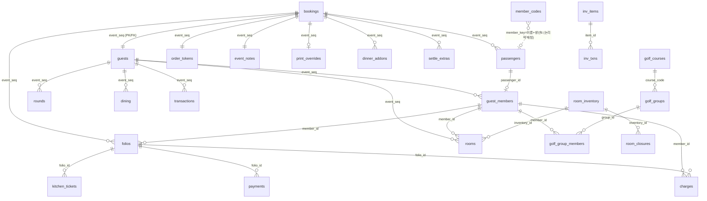

# 05. 데이터베이스 스키마 (DATABASE SCHEMA)

> **저장소명**: `saizenjp/saizenjp.github.io`
> **브랜치**: `main`
> **기준 커밋**: `8cd0ad8` (`8cd0ad8f8f68db0a2c9679e2c6452c769846b000`)
> **작성일**: 2026-07-21
> **문서 상태**: 기술기준 (SQL 마이그레이션 파일 근거)
> **분석 범위**: `ops/hub/sql/*.sql`(01~87 + 공유), `00_VERIFY.sql`, `00_DATA_AUDIT.sql`
> **제외 범위**: 실제 데이터 값, 비밀값. 라이브 DB 실측이 필요한 항목은 `확인 필요`

---

## 1. 데이터베이스 종류

- **Supabase PostgreSQL**. 클라이언트가 `supabase-js@2`로 직접 접속(URL + publishable key). 서버 로직 = SQL(RPC·트리거·RLS) + Edge Function 1건.
- 마이그레이션은 **`ops/hub/sql/NN_*.sql`을 Supabase SQL Editor에서 수동·번호순·멱등 실행**(CLI 아님). 상세 `11_DEPLOYMENT_GUIDE.md`.

## 2. 전체 테이블 목록 (레이어별)

### 엠클릭 원본층
| 테이블 | 목적 | PK | 주요 FK | 정의 |
|---|---|---|---|---|
| `bookings` | 예약리스트 마스터(팀·예약 단위, 결합키) | `event_seq` | — (마스터) | `01_schema.sql` |
| `passengers` | 일행별예약 개인 단위(PII·항공) | `id` | `event_seq→bookings` (cascade) | `01`, `07_passenger_air.sql`, `10`, `31` |
| `member_codes` | 그룹코드 참조·회원 마스터(PII) | `member_key`(79 이후 단독) | — | `01`, `79_member_master.sql` |

### 현장 운영층
| 테이블 | 목적 | PK | 주요 FK | 정의 |
|---|---|---|---|---|
| `guests` | 현장 운영 원장(팀, 허브 전역 키) | `event_seq` | `event_seq→bookings` (cascade) | `01` |
| `guest_members` | 개인 단위·태그코드 | `id`(uuid) | `event_seq→guests`(cascade), `passenger_id→passengers`(set null) | `01`, `10`, `31`, `51` |
| `rooms` | 숙박 배정(1행=1명) | `id`(uuid) | `event_seq→guests`(cascade), `inventory_id→room_inventory`(set null), `member_id→guest_members`(cascade) | `01`, `02`, `06`, `10` |
| `rounds` | 골프 라운딩 배정 | `id`(uuid) | `event_seq→guests`(cascade) | `01` |
| `dining` | 식사 배정 | `id`(uuid) | `event_seq→guests`(cascade) | `01` |
| `transactions` | 현장 거래 로그(money) | `id`(uuid) | `event_seq→guests`(cascade), `member_id→guest_members`(set null) | `01`, `03` |

### 객실·마스터
| 테이블 | 목적 | PK | 정의 |
|---|---|---|---|
| `room_inventory` | 객실 마스터 | `id`(uuid), unique(facility,room_no) | `02`, 실데이터 `05`/`15` |
| `fee_rules` | 1인 사용 추가요금 규칙 | `code` | `02` |
| `room_closures` | 객실 기간 폐쇄 | `id`(uuid), FK inventory_id(cascade) | `33` |

### 정산 코어(money)
| 테이블 | 목적 | PK | 주요 FK | 정의 |
|---|---|---|---|---|
| `folios` | 정산 계정(team/member) | `id`(uuid) | `event_seq→bookings`(cascade), `member_id→guest_members`(set null) | `09_settlement_core.sql` |
| `charges` | 통합 청구 원장 | `id`(uuid) | `folio_id→folios`(cascade), `event_seq→bookings`(set null), `member_id→guest_members`(set null) | `09`, `50`, `58` |
| `payments` | 결제 | `id`(uuid) | `folio_id→folios`(cascade) | `09` |

### B2B 정산(money)
| 테이블 | 목적 | 정의 |
|---|---|---|
| `settle_remarks` | 現地精算表 행사별 비고 | `30_settle_b2b.sql` |
| `settle_deductions` | 월별 차감(쿠폰·선납) | `30` |
| `settle_extras` | 팀별 가산/차감 기타 | `44_settle_extras.sql` |

### POS·주방·주문
| 테이블 | 목적 | 정의 |
|---|---|---|
| `menu_items` | POS 메뉴 마스터(단가) | `11_pos_menu.sql`, `13`(시드) |
| `kitchen_tickets` | 주방 조리 큐(new/accepted/done) | `12`, `20` |
| `order_tokens` | 팀별 주문 QR 토큰 | `62_order_tokens.sql` |
| `pos_display` | 손님 확인 화면 연동 | `41_pos_display.sql` |

### 인쇄·석식
| 테이블 | 목적 | 정의 |
|---|---|---|
| `print_overrides` | 팀 인쇄물 수기 오버라이드(excluded·dining_group·team_group·dinner_split·team_group_seq …) | `32`, `35`, `37`, `43`, `56`, `60`, `66`, `80` |
| `dinner_addons` | 夕食 別注(add/upgrade/allergy) | `43_dinner_addons.sql`, `58` |

### 골프
| 테이블 | 목적 | 정의 |
|---|---|---|
| `golf_courses` | 코스 마스터(aso/sobo/kuju) | `26_golf.sql` |
| `golf_groups` | 조(4-some) | `26` |
| `golf_group_members` | 조원(1행=1명) | `26` |

### 프론트·키·시즈노야도
| 테이블 | 목적 | 정의 |
|---|---|---|
| `key_bindings` | 키택(fob)↔팀 | `27_key_bindings.sql` |
| `shizu_onsen` | 別棟 온천 개인 사전신청 | `57` |
| `shizu_memo` | 시즈 날짜별 메모 | `68` |
| `shizu_water_fill` | 別棟 물채우기 기록 | `76` |
| `shizu_team_memo` | 시즈 팀 현장 메모(+ref_note) | `83`, `85` |

### 로그·권한·기타
| 테이블 | 목적 | 정의 |
|---|---|---|
| `import_log` | 업로드 감사(counts·changes) | `08`, `14` |
| `event_notes` | 팀 운영 주석 | `16_event_notes.sql` |
| `event_note_log` | 주석 수정이력(불변) | `16` |
| `change_log` | 범용 변경이력(불변·insert 전용) | `29_change_log.sql` |
| `audit_log` | 전 테이블 자동 감사(old/new jsonb) | `45_audit_log.sql` |
| `user_access` | 권한(role admin/manager/staff + areas/read_areas + active) | `18`, `25`, `46`, `49` |
| `access_requests` | 가입 요청(anon insert) | `28` |
| `announcements` | 부서 공지 | `21`, `23`, `42`, `54` |
| `inv_items` / `inv_txns` | 재고 품목/입출고 | `36_inventory.sql` |
| `followups` | 확인 필요(후속 조치) | `52` |

## 3. 뷰 (v_*) — 전부 `39`에서 `security_invoker=on` + anon revoke

| 뷰 | 목적 | 정의 |
|---|---|---|
| `v_folio_summary` | 팀별 룸차지/선불 요약 | `01`, 재정의 `03` |
| `v_folio_by_category` | 카테고리별 합계 | `01` |
| `v_folio_lines` | 개인별 룸차지 상세 | `03` |
| `v_folio_balance` | folio별 잔액(청구−결제) | `09` |
| `v_settlement_by_category` | 카테고리·기간 매출 요약 | `09` |

## 4. 주요 RPC 함수 (게이트 요약)

| 함수 | 목적 | 게이트 | 정의 |
|---|---|---|---|
| `me_access()` | 내 권한·프로필 | self | `18`(+25/46/49) |
| `is_admin()`·`has_area()`·`has_any_area()`·`has_any_read_area()` | 권한 판정 | — | `18`/`19`/`46`/`49` |
| `admin_list_users()`·`admin_set_access()`·`admin_set_active()` | 권한관리 | `is_admin` | `18`/`47`/`49` |
| `match_group_codes(text[])` | member_key→그룹코드(PII 미노출) | 없음 | `22_group_match.sql` |
| `today_summary()` | 오늘(JST) 집계 | 없음 | `21` |
| `exec_stats(date,date)` | 경영통계 | admin 또는 `stats` | `53` |
| `visitor_stats(date,date,text)` | 방문통계 | admin 또는 `report` | `55`/`78` |
| `guest_bill(text)` | 손님 QR 청구조회 | 없음(token=비밀) | `73` |
| `gc_missing_codes()` | 코드 미보유 회원(PII) | admin 또는 `has_any_read_area('groupcodes')` | `81`/`87` |
| `data_audit()` | 정합성 이상 스캔 | `is_admin` | `82` |
| `dispatch_set_memo()`·`event_note_set()` | 메모 최소권한 갱신 | 영역 제한 | `44`/`61` |
| `shizu_swap_rooms()`·`shizu_assign_rooms()`·`shizu_place()`·`shizu_unassign()` | 시즈 배정 | admin 또는 room/shizu | `67`/`69`/`71`/`75`/`77` |

**주요 트리거 함수**: `set_updated_at`(01), `rooms_capacity_guard`(40/67, 더블부킹 차단), `rooms_fill_facility`(84), `audit_row`(45, 전 테이블 감사), `dinner_addon_sync_charge`(58), `single_charge_sync_charge`(59).

## 5. RLS 모델 (계층 — 시간순 덧씌움)

1. `04_rls_anon.sql` — 개발용 anon 전체허용(임시).
2. `17_rls_harden.sql` — anon 제거·**authenticated 전용** 잠금.
3. `18_access_control.sql` — `user_access`(role/areas) + 권한함수 도입, deny-by-default.
4. `19_rls_areas.sql` — **카드(area)별 RLS**. 쓰기=`has_any_area`, 돈 테이블=settle/pos, member_codes=admin.
5. `39_settle_views_security_invoker.sql` — 정산 뷰 우회 차단(+folios/charges/payments 읽기에 front 추가).
6. `46_read_write_areas.sql` — `read_areas` 도입, 민감 SELECT=`has_any_read_area`.
7. `49_account_block.sql` — `active` 게이트(비활성=전부 false).
8. `65_groupcodes_area.sql` — member_codes를 groupcodes 영역으로.

- **PII 테이블**: `passengers`(여권·생년·전화), `member_codes`(이름+생년), `guests`/`guest_members`/`bookings`(성명).
- **금전 테이블**: `transactions`·`folios`·`charges`·`payments`·`settle_*`·`fee_rules`·`menu_items`·`bookings.sales_amount/unpaid_amount`·`audit_log`.
- ⚠ 정책 파일 재실행 순서 주의: `19` 재실행 시 `39`의 front 읽기 추가가 초기화 → `39` 재실행 필요(39 주석 명시).

## 6. ER 다이어그램 (핵심 관계)

> 참고: `member_codes ↔ passengers`는 물리 FK가 아니라 **member_key(이름+생년6자리) 논리 매칭**(`match_group_codes` RPC). `user_access.user_id → auth.users(id)`(cascade)는 Supabase Auth 스키마 참조.

## 7. 마이그레이션 넘버링·검증

- `NN_설명.sql`, 헤더에 선행 의존 명시(멱등·수동·번호순). 워크스트림 병렬로 일부 번호 분기: 정산 `09/11/12/13`, 이후 `14`.
- **번호 충돌**: `43`(dinner_addons / dinner_exclude_reason), `44`(dispatch_memo_rpc / settle_extras) — 같은 번호 2파일. **결번 `72`**.
- `00_VERIFY.sql` = 산출물(테이블·컬럼·함수·정책·트리거) 존재를 `✅/❌`로 점검(읽기 전용). `00_DATA_AUDIT.sql` = 데이터 정합성 8종 스캔(cnt=0 정상). 서버 RPC판 = `82_data_audit.sql`.

## 8. 확인 필요

- `rooms.member_id` 파일상 `bigint` vs `guest_members.id uuid` 불일치 → 라이브 실제 타입.
- `07_passenger_air.sql` 컬럼은 `00_VERIFY`에서 자동검사 제외(환경차) → 적용 상태 파일로 미확인.
- 각 마이그레이션의 **라이브 적용 여부**는 `00_VERIFY.sql` 실행으로 확인.
