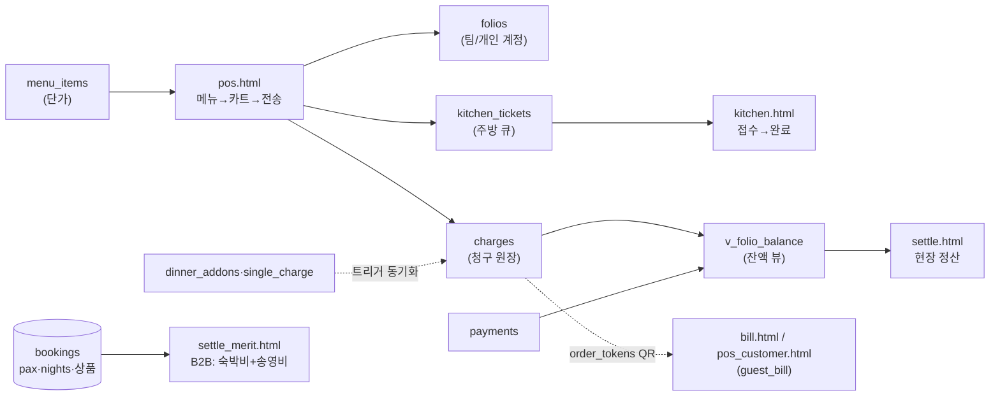

# 09. POS · 정산 흐름 (POS & SETTLEMENT FLOW)

> **저장소명**: `saizenjp/saizenjp.github.io`
> **브랜치**: `main`
> **기준 커밋**: `8cd0ad8` (`8cd0ad8f8f68db0a2c9679e2c6452c769846b000`)
> **작성일**: 2026-07-21
> **문서 상태**: 기술기준 (코드 근거)
> **분석 범위**: `pos.html`·`kitchen.html`·`menu.html`·`pos_customer.html`·`bill.html`·`settle.html`·`settle_merit.html`, 관련 SQL
> **제외 범위**: 실제 금액·데이터

---

## 1. POS 연동 방식

- **외부 POS 없음.** `ops/hub/pos.html`(data-so-area=`pos`)이 내부에서 `charges`에 직접 적재(근거 `pos.html:301-302`, v1). 외부 결제 단말/포스기 연동 코드 없음.
- **흐름**: 오늘 체크인 팀 선택 → 메뉴 그리드(`menu_items`) → 카트 → 전송.
  - `folios`(팀/골프 계정 확보 insert, `:830,845`), `charges`(insert, `:890`), 주방행 항목만 `kitchen_tickets` 발행(`:898`).
  - outlet 파라미터: `?outlet=front|golf|restaurant`.
- **개인 folio 분할**: 팀 클릭→명단→팀공통/특정1인/N분의1 → `charges.member_id` + 개인 folio(subject='member') 자동 생성.

## 2. 결제·이용내역 데이터

| 테이블 | 역할 | 정의 |
|---|---|---|
| `folios` | 정산 계정(subject team/member, status open/closed/settled) | `09_settlement_core.sql` |
| `charges` | 통합 청구 원장(category 라운딩/식음/숙박/골프샵/기타, amount·tax·pay_method·link_ref) | `09`·`50`·`58` |
| `payments` | 결제(method 현금/카드) | `09` |
| `kitchen_tickets` | 주방 큐(status new→accepted→done) | `12`·`20` |
| `order_tokens` | 팀별 주문 QR 토큰 | `62` |
| `menu_items` | 메뉴 마스터(단가·venue·station) | `11`·`13` |

## 3. 주방 연동 — `kitchen.html` (data-so-area=`kitchen`)

- KDS: `kitchen_tickets`(status=new) 라이브 큐, **7초 폴링**, 접수(accepted, accepted_by 기록)/완료(done). charges(돈)와 **분리**(근거 `kitchen.html:134-136`, `sql/20_kitchen_accept.sql`).
- `pos.html` 하단 "주문 현황" 패널이 오늘 티켓을 팀별·상태배지로 폴링 → 프론트가 주방 수락 실시간 확인.
- `?view=front` = 바/프론트 통합.

## 4. 손님 셀프 조회 — `pos_customer.html` · `bill.html`

- QR(`order_tokens`, 접두 예 `SZ`)로 손님 태블릿/폰에서 청구내역 조회.
- `bill.html` = 토큰(`?t=`)으로 `guest_bill` RPC(`sql/73`, anon 허용·token=비밀).
- `pos_customer.html` = `charges` 조회(자체 로그인/스테이션 파라미터).
- ⚠ 이들은 `saizen-ops.js` 미로드(고객용)라 페이지가드 없음 — 접근 제어는 토큰/자체 로그인.

## 5. 정산 데이터 생성 (2개 레이어 — 명확히 별개)

### A. 현장 정산 folio — `settle.html` (data-so-area=`settle`)
- 손님 현장 추가요금(추가라운드·미니바·캐디·룸업그레이드 등)을 folio로 집계.
- **읽기**: 뷰 `v_folio_balance`(session_ym 필터). **쓰기**: `folios`(status=settled), `charges`(insert/void/pay_method), `payments`(insert/void).
- 개인 folio 분할 묶음 표시(event_seq 그룹화). SQL `09`·`44`·`50`·`59`·`39`(뷰 보안).

### B. Merit B2B 선계약 정산 — `settle_merit.html` (data-so-area=`settle`)
- 現地精算表 = **메리트투어↔사이젠 선계약 = 숙박비 + 송영비**(근거 `:169`).
- 계산(`:405-411`): rate=`SZCore.accomRate`(야마나미·쿠주 14,000 / 간지·시즈 16,000 ¥/인/박), stay=`pax*nights*rate`, transport=`pax*6000`, extra=팀별 가감(`settle_extras`).
- 총매출=stay+transport, 차감(`settle_deductions`: 보증금 쿠폰·장기숙박 쿠폰·이용권·포인트·선납·기타), Net.
- Excel 2시트(요약+명세, ExcelJS). SQL `30_settle_b2b.sql`·`44`.
- ⚠ 현장 추가요금(=A, settle.html)과 **섞지 않음**(코드 주석 명시 `:143,194,214-215`).

## 6. 마감 처리

- folio `status` open→closed→settled(수동 마감). `payments` 입력으로 잔액 정산.
- ⚠ **명시적 "일 마감/월 마감" 배치·잠금 기능은 코드상 미발견** — **확인 필요**(마감 기준·되돌림 정책은 현장 운영 규칙).

## 7. 오류·재처리

- `charges`/`payments` **void**(취소) 플래그로 무효화(삭제 아님). 자동연동 청구(별주·싱글차지)는 트리거로 charges 동기화(`58`·`59`).
- 정합성 위험(`14_KNOWN_ISSUES` §4): folio 중복 open 유니크 없음, 동시결제 중복→잔액 음수, 미등록 숙소 0원 무음, N분의1 세액 ±1엔 — **확인·개선 대상**.

## 8. Mermaid — POS→정산 데이터 흐름

## 9. 관련 파일·SQL

- 화면: `pos.html`·`pos_customer.html`·`kitchen.html`·`menu.html`·`bill.html`·`settle.html`·`settle_merit.html`
- SQL: `09_settlement_core.sql`·`11_pos_menu.sql`·`12_kitchen_tickets.sql`·`13`·`20`·`30_settle_b2b.sql`·`39`·`41`·`44`·`50`·`58`·`59`·`62`·`73`
